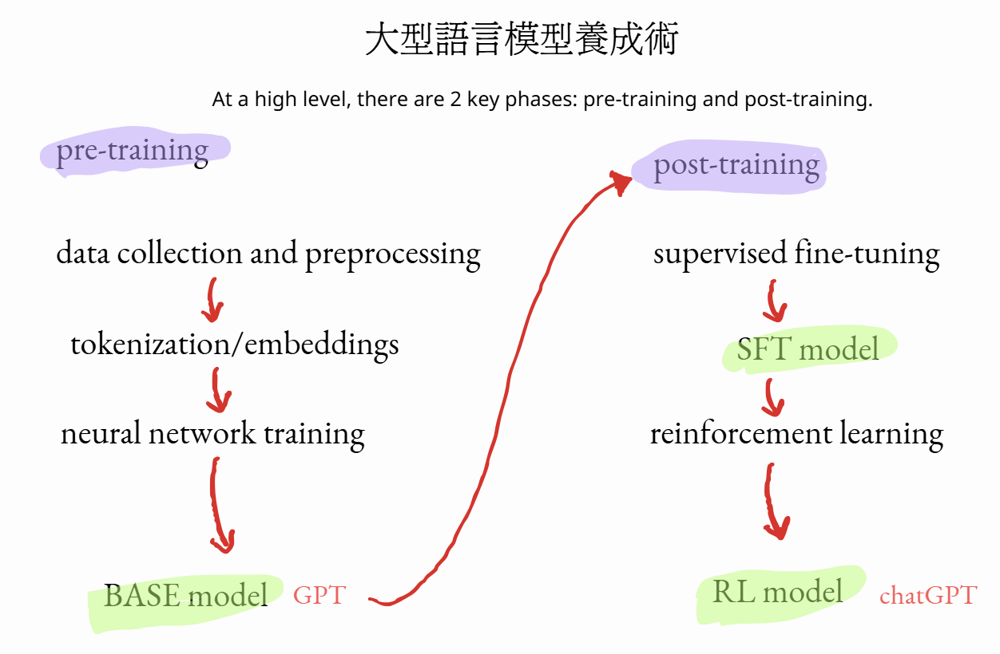
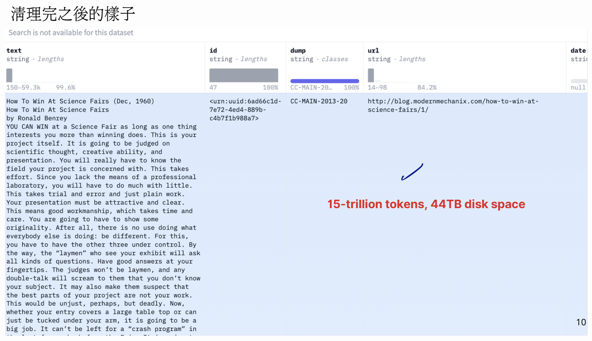
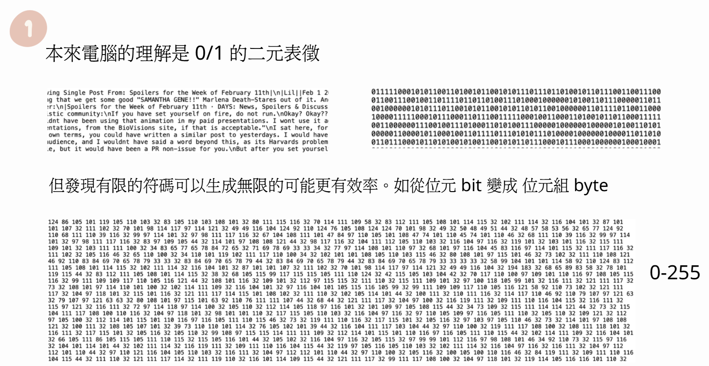
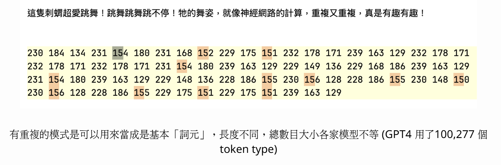
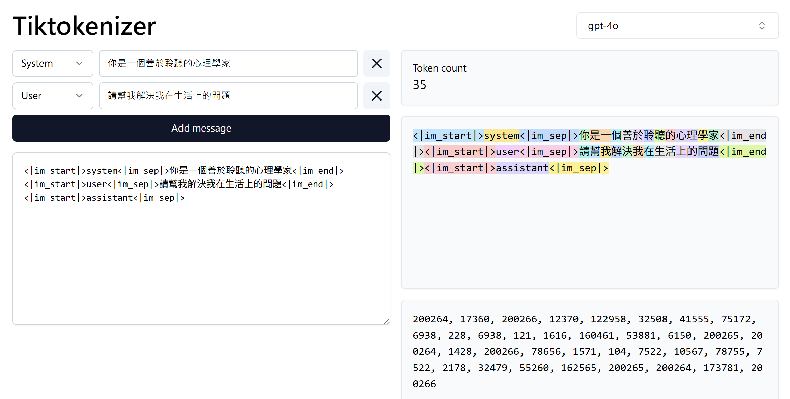

# WEEK 4

# 大型語言模型養成流程圖

## 01 取料與備料

> [https://huggingface.co/spaces/HuggingFaceFW/blogpost-fineweb-v1](https://huggingface.co/spaces/HuggingFaceFW/blogpost-fineweb-v1)

## 02 清理

## 03 切符(tokenization)

對模型而言的 Token：

1. 將原始文字序列資料拆解後的最小單位，類似於拼圖中的一塊塊小碎片(Variable size)
2. 可以是字母、單字、片語、標點符號，甚至是更細分的字根或字首，像素、音訊取樣點，具體依模型的設計而定(Understanding context)
3. 切符的方式，有不同的演算法。但目的皆為讓切出來的單位，可以幫助模型更清楚地捕捉和表達語意。(Breakdown of text)

本來電腦的理解是 0/1 的二元表徵，但發現有限的符碼可以生成無限的可能更有效率

### 如從位元 bit 變成 位元組 byte

### 有重複的模式是可以用來當成是基本「詞元」，長度不同，總數目大小各家模型不等

> (GPT4 用了100,277 個token type)
>
> - But 哈佛大辭典大概 20 萬個 word_type
>
> - 中文辭典大概 1 萬上下，但人類平常會用到的大概五千（是「字」不是「詞」）

### 對 AI 來講的基本單字 --> 看他怎麼切字符

把原始文本轉換成 token sequence，就是 tokenization

> https://tiktokenizer.vercel.app/

網站中右側的不同顏色是他自己分出來覺得的單字

