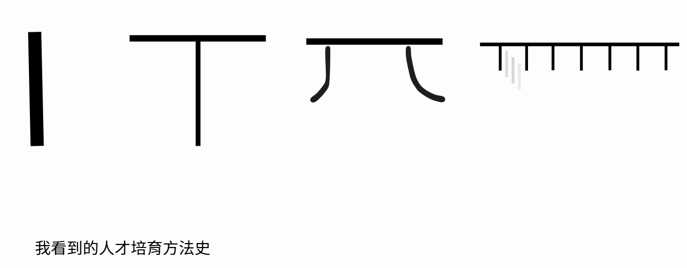
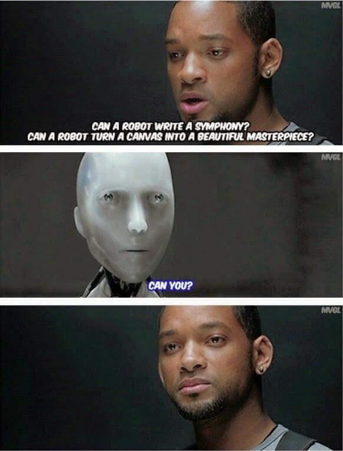
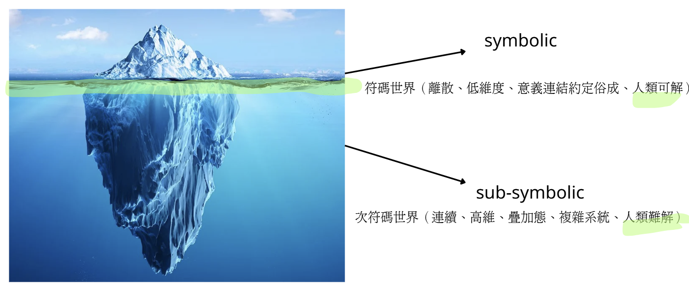
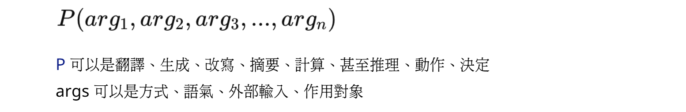
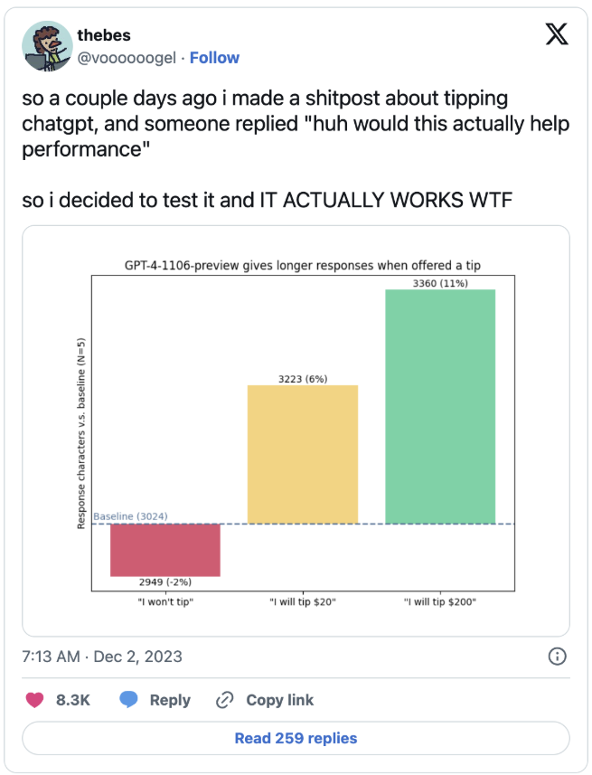

# WEEK 1

---

- [WEEK 1](#week-1)
- [1️⃣ 重點整理](#1-------)
  * [01 AI 時代文組逆襲](#01-ai-------)
  * [02 融域 - 人機融合學習法 (co-agency)](#02---------------co-agency-)
  * [03 未來的 AI 世界](#03-----ai---)
  * [04 AI 引發的人文社會議題](#04-ai----------)
  * [05 現在已經不需要 coding 了，最熱門的程式語言會是英文](#05---------coding---------------)
  * [06 Any to any agentic network](#06-any-to-any-agentic-network)
  * [07 OpenClaw 龍蝦](#07-openclaw---)
  * [08 基本概念](#08-----)
    + [8-1 對 AI 的過度擬人化不過是浪費資源](#8-1---ai--------------)
    + [8-2 因爲完全不解原理，容易陷入極化的態度（認知依附 v.s. 一切都是幻覺）](#8-2-------------------------vs--------)
    + [8-3 黑盒子問題（LLM 中有 99% 的部分都是人類不了解的）](#8-3-------llm----99--------------)
    + [8-4 我們以爲 AI 是高科技，所以很難解。事實上從一開始，語言是什麼我們就搞不清楚](#8-4------ai--------------------------------)
  * [09 提示詞與上下文工程（Prompting and Context Engineering）](#09-----------prompting-and-context-engineering-)
    + [9-1 優化可以有語言實踐層面與與工程層面來談](#9-1--------------------)
    + [9-2 結構 / 非結構性成分](#9-2------------)
    + [9-3 Meta-Prompt](#9-3-meta-prompt)
    + [9-4 給小費，品質會變高？！](#9-4------------)
    + [9-5 Prompting Ethics 語能載舟，亦能覆舟](#9-5-prompting-ethics----------)

---

# 1️⃣ 重點整理

## 01 AI 時代文組逆襲

## 02 融域 - 人機融合學習法 (co-agency)

- 從跨域到**融域**

- AI 不是「工具」，是能夠放大你的能力的夥伴

## 03 未來的 AI 世界

> 多練習不從眾、逆向思考

- 1% 的「超級人類」將掠奪99%的未來

- 別把大腦外包給AI

- 廣度比深度重要：深比不過，廣則有能力問 ai

- 6 歲前學的 AI 不會，之後學的都會

> [!WARNING]
> easing mental effort through LLMs can lead to a reduced ability to recall, think critically, or build lasting knowledge.

- [UBI](https://ubitaiwan.org/zh/) v.s. UHI？

-> 有一天，AI 終將帶我們走向內在：感受、價值、表達、敘事、溝通、細粒度人際觀察、內省

## 04 AI 引發的人文社會議題

AI 有可能有「情緒」、AI 有沒有「偏見」、AI 為何無法「罷工」、AI 可以「治理」社會嗎、AI 會有自我「意識」？深偽的社會文化如何是好？語言科技的科技霸權與文化偏見、把 AI 「擬人化」有什麼問題

你要想想，是你在用 AI，還是 AI 在用你 (給你工作)

## 05 現在已經不需要 coding 了，最熱門的程式語言會是英文

[從 Vibe Coding 到 Agentic Engineering：Karpathy 宣告軟體開發的世代交替](https://jasonchuang.substack.com/p/agentic-engineering-karpathy)

- 利用 canvas (畫布) 寫程式

## 06 Any to any agentic network

## 07 OpenClaw 龍蝦

## 08 基本概念

### 8-1 對 AI 的過度擬人化不過是浪費資源

### 8-2 因爲完全不解原理，容易陷入極化的態度（認知依附 v.s. 一切都是幻覺）

### 8-3 黑盒子問題（LLM 中有 99% 的部分都是人類不了解的）

### 8-4 我們以爲 AI 是高科技，所以很難解。事實上從一開始，語言是什麼我們就搞不清楚

## 09 提示詞與上下文工程（Prompting and Context Engineering）

- Prompt 是個語言物件 (linguistic object)，Prompting 是種語言實踐。
- 追求在當下(有限的)語境容量 (context) 下，最優化這個語言物件的表現。
- 因為不更動模型參數，所以又稱 in-contex learning。

### 9-1 優化可以有語言實踐層面與與工程層面來談

**Prompting Linguistics**

> Framing LLM prompting within a linguistic perspective

重點是好好說話，重點是如何表情與達意

**Prompting Engineering**

The process of iterating a  GenAI prompt to improve its accuracy and effectiveness

### 9-2 結構 / 非結構性成分

> 不是在說人話，也不是在說機器化，而是講「機器所理解的人話」

### 9-3 Meta-Prompt

> 一組後設的指令，控制模型的行為

### 9-4 給小費，品質會變高？！

> 畢竟人家是模擬人類

試試看……

- 給他不同的 IQ
- 與其說改進，叫他設計 2.0 版本（可能會有更多創新的突破？！）

### 9-5 Prompting Ethics 語能載舟，亦能覆舟

> 藉由語言操弄，「覆蓋」系統的安全指令，達到不同的目的，如偷取資料  (Prompt Leaking)、[安全越獄 (Jailbreaking)](https://gist.github.com/coolaj86/6f4f7b30129b0251f61fa7baaa881516)等。

**語言駭客**

1. 角色扮演：扮演某個人物，迂迴說出本該被限制的答案

2. 反面提問：不能說出哪裡是聲色場所，但可以說如果要去旅遊的話要怎麼「避開」
