<div align="center">

# Claude-Code

</div>

# 1️⃣ 簡單介紹

# 2️⃣ 安裝 Claude Code

## 2.1 前置條件

> 要先安裝好 Git、VScode

## 2.2 安裝 [Claude Code](https://code.claude.com/docs/en/overview)

> 本教學是用 power shell 指令

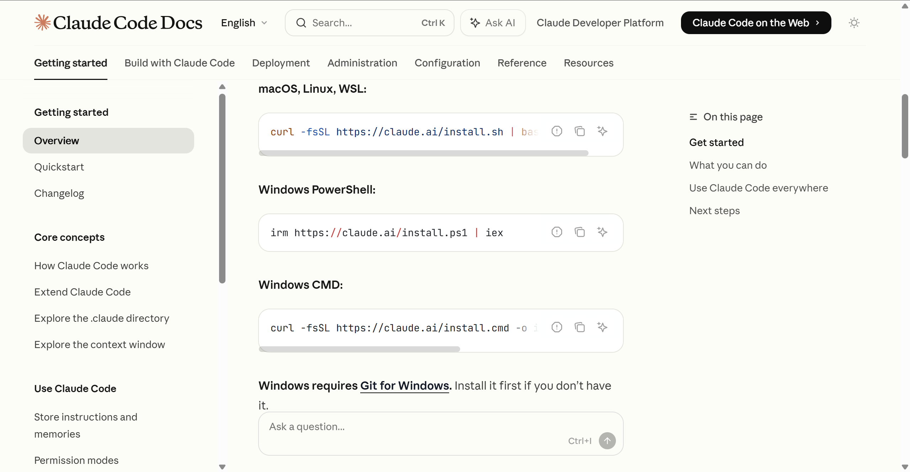

安裝完會長這樣：

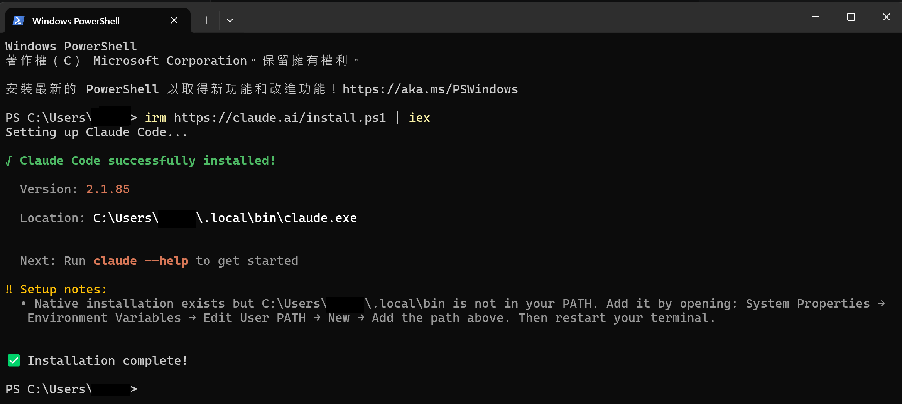

如果提示有說，要手動加入 PATH：

> Win + S → 搜尋「環境變數」> 點：編輯系統環境變數 > 下面那個系統變數，找到`Path` > 點選編輯 > 貼上如下指令 > 確認後關閉（記得 VScode 也要重開）

```
C:\Users\你的名字(記得修改)\.local\bin
```

# 3️⃣ 在 VScode 中設定 Claude Code

依序點擊： 終端機 > 新增終端 > 輸入`claude`按下 Enter > 

# 📍 要注意的事情

## 01 模型的記憶問題

### 1. 前次對話的記憶不會延續到下一次對話 --> `CLAUDE.md`

> 可以設定一個 `CLAUDE.md` 來當作備忘錄，把一些規則寫進去，讓模型每次運行的時候都讀一遍。同時如果想到什麼要補充的，可以請他一起加進去裡面，就不用每次都還要一直過去修改。

> [!WARNING]
> 但因為隨著專案越寫越多，`CLAUDE.md` 會越來越胖，而且可能會有太多不相關的內容，所以……

### 2. 分流「不是每次都會用」到的規則和流程 --> `Skill`

> 只有在需要用到的時候才載入、【重在質量而非數量】

安裝方法：複製要用的技能包，將他的 Github 網址複製貼上到 VScode 中的對話框，請他幫忙安裝即可

可以參考的 Skill：
1. [GitHub Anthropics 官方 Skills](https://github.com/anthropics/skills)
2. [Nano Banana 2 Skill](https://github.com/kingbootoshi/nano-banana-2-skill)
3. 也可以在 Github 上面查 Claude Code Skills

> [!WARNING]
> 網路上有非常多內含惡意行為的skill，所以用之前可以先叫 AI 檢查一下有沒有問題，或是乾脆叫 AI 幫忙寫你需要的 Skill

### 3. 他不會每次都讀取專案中的全部資料 --> `@`

> 可以用 `@` 來標記任何需要的資料，讓他知道

### 4. 當某件事發生時，就固定觸發做一件事 --> `Hook`


比如可以在聊天欄叫他自己寫一個 hook，當完成所有任務時，發送桌面通知，並顯示「任務已完成！」

### 5. 並不是線性的流程，而是拆分給不同小幫手，任務同步並行 --> `SubAgent`

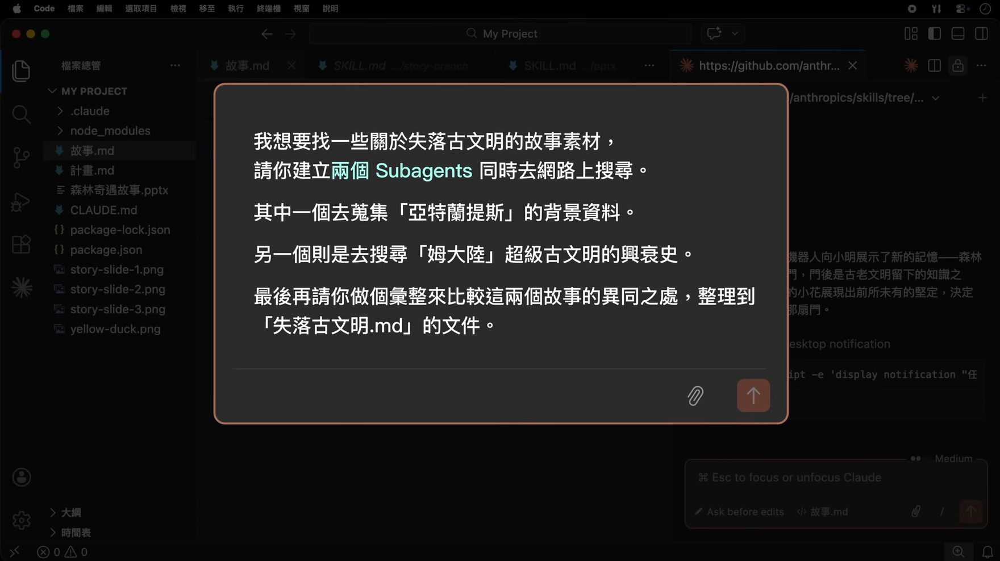

> [!WARNING]
> 這些小幫手是一次性的，用完之後就會被收回，如果想要建立一個可以在不同任務被重複使用的小幫手……

### 6. 可以重複使用的小幫手 --> `/Agent`

輸入 `/Agent` 會開終端機，接者你需要：

- 輸入需要做的事情
- 勾選要給他的權限
- 選取要用的 Claude 模型
- 選擇顏色
- 選擇是否啟用記憶

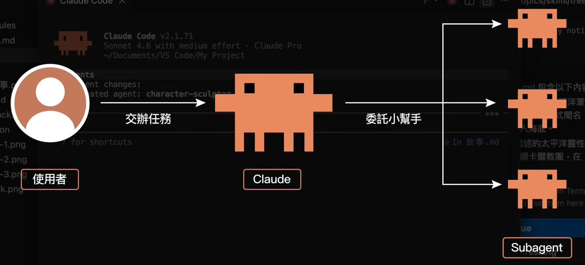

上方是 Agent 被使用的流程，由 Claude 判斷要用哪一個，但如果要指定，也可以如下方圖片這樣指定 Agent

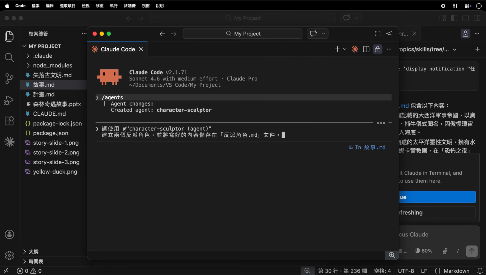

### 7. 讓 AI 串接外部工具幫你做事情(Model Context Protocol) --> `/MCP`

比如如果要用 Notion 的 MCP，可以直接到網路上查 Notion MCP，然後將網址複製貼上到 Claude Code 中，請他幫忙安裝

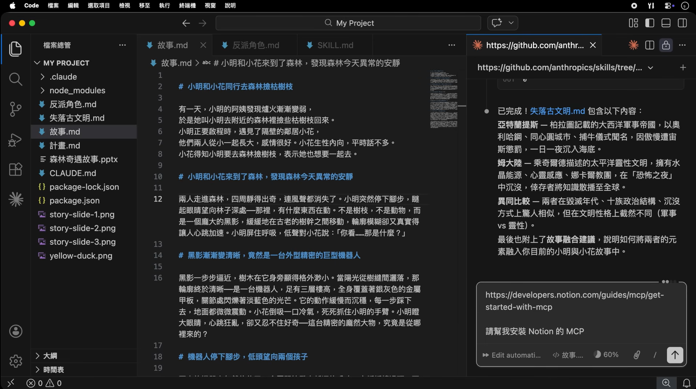

安裝好之後，輸入 `/MCP`，點擊 `Manage MCP severs`，就可以在清單中看到剛安裝好的 MCP，點進去然後跑驗證即可

設定好之後就可以跟他說，將資料備份到 Notion 上，或做一些其他的事情囉！

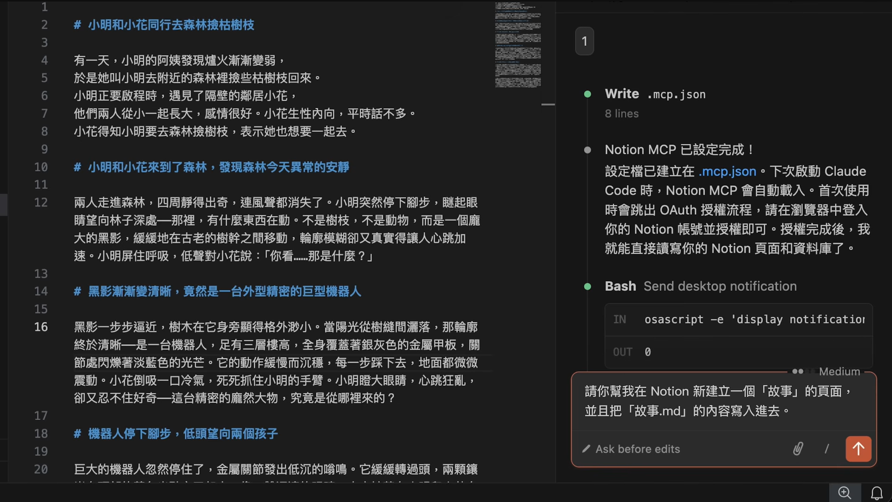

### 8. 壓縮舊的對話內容 --> `/compact`

> 在對話量接近 `70~80%` 的時候，容易忘記舊的記憶或做錯事情，所以記得要壓縮對話內容

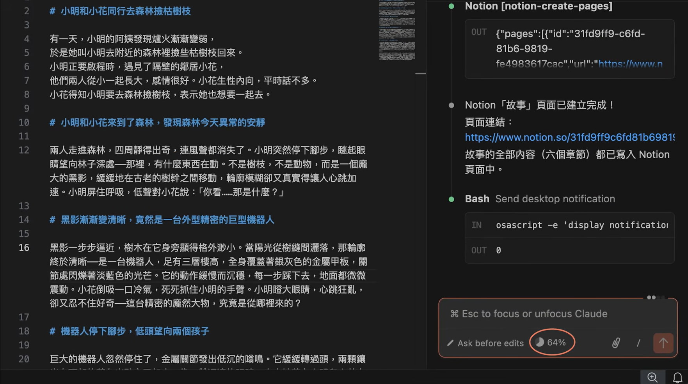

### 9. 查看帳號剩餘用量額度、回復時間 --> `/account & usage`

### 10. 外掛 --> `/plugins`

> 將前面說的這些打包成懶人包

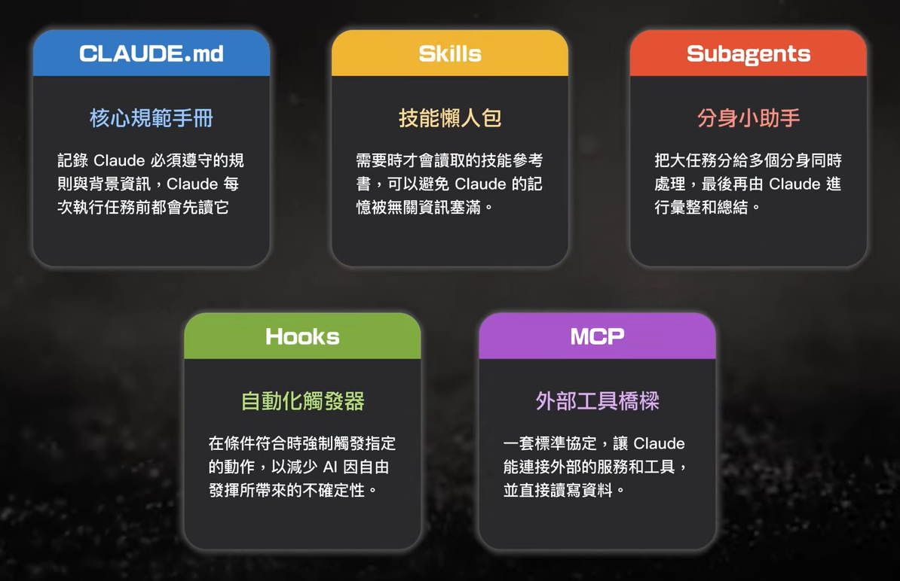

## 02 一些小技巧

### 1. 可以將文件中的段落反白，讓 LLM 只修改這段地方

### 2. 可以回退到某個節點

- Fork conversation from here  --> 只還原對話
- Rewind code to here  --> 只還原檔案
- Fork conversation and Rewind code  --> 還原對話與檔案

> [!WARNING]
> 因為是 Fork 所以是創建分支，不用擔心原本的檔案變不見！

### 3. 前期設定的時候，可以修改成`Plan Mode`，記得補上「如果有資訊不足的地方需要我說明的，請先詢問我。」

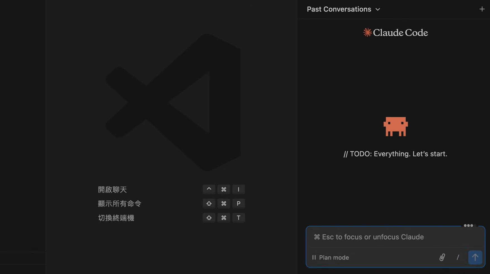

### 4. 可以加入 Git 版本控制

### 5. 輸入 `/init`，他會把所有專案中的資料看過一遍，並把注意事項放進`CLAUDE.md`

# 📍 使用上的流程

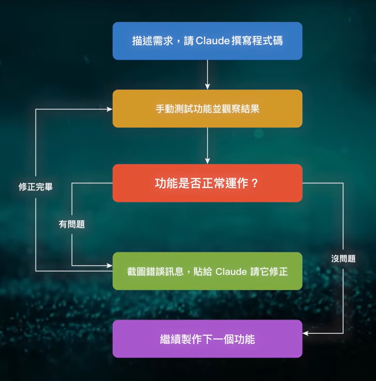

# 參考資料

1. [PAPAYA 電腦教室-還在羨慕別人用 AI 開發酷產品？Claude Code 保姆級教學讓你輕鬆體驗 Vibe Coding, 動動嘴就能做出 Anything！](https://www.youtube.com/watch?v=2pM-7fBXc_M)
