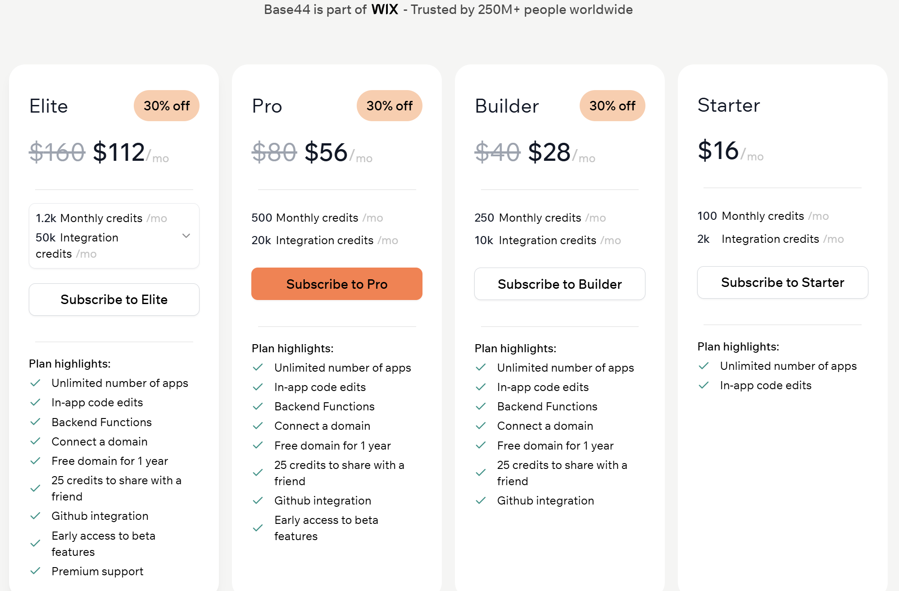

<div align="center">

# Base44

</div>

> [!WARNING]
> 沒辦法下載檔案，要先升級才能夠打包下載

> 免費套餐每日可發送 5 則訊息，每月訊息總數上限為 25 則。此外，您還將獲得 100 個整合積分，可用於體驗各種整合功能，例如身份驗證、資料庫和分析。
> 
> 免費方案即可讓您存取所有核心整合類型，使您能夠建立具有用戶身份驗證、資料儲存等功能的完整應用程式——所有這些都無需任何費用。



# Prpmpt（點 Code 複製）

我想要寫一個 AI 的應用，可以讓人類、 AI 與 AI 互動創作故事，會有以下幾個主要功能：

# 必要能力
## 串接 LLM API
1. 由使用者串接自己的 LLM API，串接方式為串接 dify.ai 的 API，就像 cline 可以用 dify 的模型一樣，讓使用者也可以選擇串接他們自己 dify 的 AI，使用 LLM 模型
2. 其中會需要已設定好 systemprompt 的 個 LLM 模型，使用者會於自己的 dify 處設定好，並自行選擇不同 API 進行串接
   - A LLM：世界觀設定模型
   - B LLM：角色設定模型

## 資料庫
其中的資料需要儲存在資料庫中，以防使用者離開後消失

## 資料匯出
1. 使用者的所有資料，應該要是可讓其帶走的形式，如存在資料庫中的資料，應該要可以用資料庫的形式匯出帶走
2. 使用者創作出的故事，可以匯出為 PDF / Markdown 的形式匯出
3. 加上一個「專案項目下載」的按鈕，若是有喜歡這個項目的人，可以點擊下載 `.zip` 將此項目包回去，然後自行部屬，其中，安裝包要加上一個教學他們要怎麼部屬的文檔。zip的下載應該是將此專案的所有必要檔案都封包，給使用者直接下載，而不是讓使用者還需要去額外去搜尋原始檔。

## 使用者編輯自由
不管是世界觀、人物、情節，還是故事，在生成後，使用者都可以對其中的任何一個部分（如標題、內容）隨時進行修改

## AI 資訊資料處理
由 AI 輸出的世界觀、角色、情節，應該都以卡片形式呈現，使用者可以修改/編輯/移動等等，如若不想要，可以選擇封存，保存在封存箱空間中

## 於刪除或封存時可多選
像是世界觀、角色、情節、故事等等，在選擇要刪除或封存的時候，可以多選，使用者才不會要一個一個點擊

# 應用的主要功能

> 以下功能可以分為不同頁面，可能不會太擁擠

## 01 創造世界觀

> 需要 A LLM

由使用者提出世界觀設定，使用者可以有三種方式創造世界觀：

1. 自行從零開始進行細部設定（無須 LLM 介入，直接編輯）
2. 提出想法，由 A LLM 進行延伸拓展以設定*
3. 給予一篇現有的小說，或是相關資料，由 A LLM 擷取初期其中的世界觀設定，並由使用者確認**
   
三種設定方法各自有不同的版面，世界觀設定完成後，會儲存，但仍可由使用者在未來做編輯

*其中方式二給予 A LLM 的 prompt 大致會呈現為：

```
這是對於故事世界觀設定的想法：
{
放入使用者對世界觀設定的想法
...
}

請依據上述的設定，設計出世界的世界觀
```

**其中方式三給予 A LLM 的 prompt 大致會呈現為：

```
這是對於故事世界觀設定的現有故事：
{
放入使用者對世界觀設定的小說或故事內容
...
}

請依據上述的設定，統整歸納出小說中世界的世界觀
```

在輸出給 API 的 prompt 請如上述設計（在設計時可以擇優加入或擴展內容）。

## 02 設定人物配角

> 需要 B LLM

使用者可以根據世界觀進行角色設定，有兩種方式，一種式使用者自行設定，另一種由 LLM 設定的流程大致為：

使用者選擇世界觀 --> 使用者選擇角色數量 --> *給予 prompt 由 B LLM 創造出角色（依據使用者的設定，會有 (1)姓名、(2)年齡、(3)身分背景描述，應有各自的呈現欄位) --> 由介面呈現出各自的設定給予玩家選擇要棄 / 留 / 修改那些角色，角色可以在未來做編輯

在創建角色後，可以由使用者對每個角色加上 #(hashtag)，並呈現在角色的卡片呈現形式上，方便分類。其中，預設每個角色在生成後，會自動擁有該世界觀的分類標籤，該標籤顯示在最前面，並與後續由使用者設定的標籤有顏色上的區分。人物的頁面應該可以用標籤進行人物的篩選，並預設不同的世界觀標籤將不同的人物進行分類區隔。

*其中給予 B LLM 的 prompt 大致會呈現為：

```
這是故事的世界觀設定：
{
放入使用者選擇的世界觀設定
...
}

請依據上述的設定，設計 {使用者於介面上選擇的角色數量} 個角色，分別進行角色設定
```

在輸出給 API 的 prompt 請這樣設計（在設計時可以擇優加入或擴展內容）。


## 03 依世界觀與人物進行時間線與大綱設定

> 需要 C LLM

使用者可以根據世界觀、角色，在選擇小說長度後設定故事線與大綱，設定的流程大致為：

使用者選擇世界觀 --> 使用者選擇角色（主角/配角） --> 使用者選擇內容長短：(1)超短篇(500字，設計故事大綱)、(2)短篇(5000字，設計故事大綱)、(3)中篇(15000字，分3個章節，設計章節標題與大綱)、(4)長篇(40000字分10個章節，設計章節標題與大綱)、(5)超長篇(100000字分20個章節，設計章節標題與大綱) --> *給予 prompt 由 C LLM 創造出大綱 --> 由介面呈現出各自的設定給予玩家選擇要棄 / 留 / 修改那些大綱，使用者可以在未來做編輯（p.s. 使用者選擇的世界觀、角色會以標籤的形式記錄在這些大綱中，方便後續匯給故事生成的 LLM 使用)

其中不同內容長短的故事大綱在輸出後應該處於不同的空間或標籤，便於使用者管理。

*其中給予 C LLM 的 prompt 大致會呈現為：

```
這是故事的世界觀設定：
{
放入使用者選擇的世界觀設定
...
}

這是故事的人物設定：
{
放入使用者選擇的人物設定
...
}

請依據上述的世界觀與人物設定，以及主配角，進行故事設計，請設計 {使用者於介面上選擇的內容長短} 的故事內容。
```

在輸出給 API 的 prompt 請這樣設計（在設計時可以擇優加入或擴展內容）。

## 04 依照大綱進行故事生成

> 需要 D LLM

使用者可以根據世界觀、角色，在選擇小說長度後設定故事線與大綱，設定的流程大致為：

使用者選擇不同內容長短的大鋼、世界觀、角色 --> *由 D LLM 藉由 prompt 創造出故事 **［其中有分章節的，讓 LLM 知道不同章節的標題與大綱後，分次讓他升成不同章節］ --> 儲存在頁面中，由使用者觀賞（故事的呈現形式希望可以有 MD 語法的支持，不要匯讓粗體顯示成 **配角姓名** 這樣，不便於閱讀）

故事在介面中的呈現是以標題、少量文字組閣的預覽形式，不同的故事是各自的卡片式呈現。其中，如果有章節的，可以不要一次全部的內容都堆疊在一起，在使用者點進去該故事的卡片之後，以分章節的形式呈現。

*其中無分章節給予 D LLM 的 prompt 大致會呈現為：

```
這是故事的世界觀設定：
{
放入故事大綱設定中，記錄成標籤的那些世界觀設定
...
}

這是故事的人物設定：
{
放入故事大綱設定中，記錄成標籤的那些人物的設定
...
}

這是故事的情節與大綱設定：
{
放入使用者選擇的故事大綱設定
...
}

請依據上述的世界觀與人物設定，以及故事情節，進行故事設計，請設計 {紀錄於標籤中的長短的字數} 的故事內容。
```

*其中有分章節給予 D LLM 的 prompt 大致會呈現為（並會依據章節長度，分多回合傳訊請 LLM 輸出故事）：

```
這是故事的世界觀設定：
{
放入故事大綱設定中，記錄成標籤的那些世界觀設定
...
}

這是故事的人物設定：
{
放入故事大綱設定中，記錄成標籤的那些人物的設定
...
}

這是故事的情節與大綱設定：
{
放入使用者選擇的故事大綱設定
...
}

請依據上述的世界觀與人物設定，以及故事情節，進行故事設計，請根據章節數量，分章節、分次輸出故事內容。
```

在輸出給 API 的 prompt 請這樣設計（在設計時可以擇優加入或擴展內容）。
